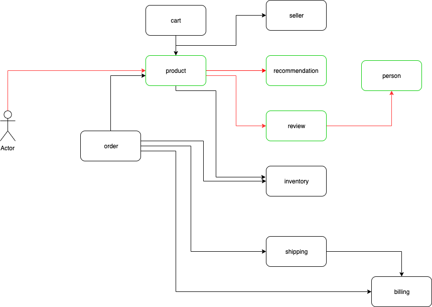

# Sample set of microservices

This can be used to demonstrate:

1. Service mesh
2. Live debugging of remote microservices using [OpenVPN](https://openvpn.net/) or [Telepresence](https://www.telepresence.io/)

I have built only a subset of the APIs (Marked in green) shown in the above diagram that are just enough to demonstrate the functionality.

# Troubleshooting

To delete the namespace forcibly (in case it gets stuck in terminating state) run:

> kubectl proxy

> ./delete-ns.sh
