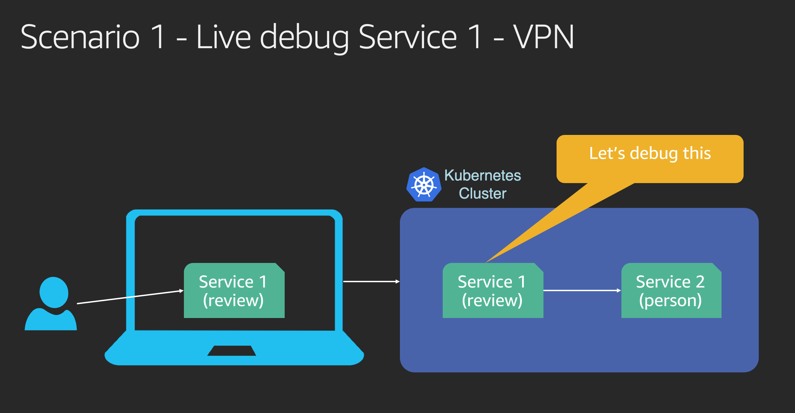
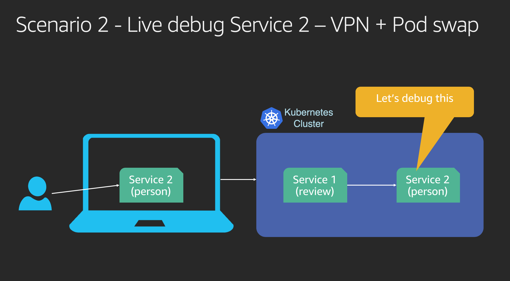

# Live debugging using Telepresence

1. [Install telepresence](https://www.telepresence.io/reference/install)
2. clone the repo

> $ git clone https://github.com/prabhatsharma/ecommerce-microservices

3. Deploy all microservices

> ./deploy-app.sh

4. Verify the deployment

> kubectl get pod,services

<pre>
NAME                                                        READY   STATUS    RESTARTS   AGE
pod/person-96d44f4fd-2trqp                                  1/1     Running   0          5m50s
pod/product-7dd48bb785-mwm2p                                1/1     Running   0          5m49s
pod/recommendation-v1-8449bfb584-wlbp4                      1/1     Running   0          5m48s
pod/review-v1-8565b4d6f7-m4zkp                              1/1     Running   0          5m47s
pod/telepresence-1573028244-055338-49272-6d95b9d9cf-9s7xh   1/1     Running   0          2m38s

NAME                     TYPE        CLUSTER-IP       EXTERNAL-IP   PORT(S)   AGE
service/person           ClusterIP   172.20.191.35    <none>        80/TCP    5m50s
service/product          ClusterIP   172.20.252.145   <none>        80/TCP    5m49s
service/recommendation   ClusterIP   172.20.47.37     <none>        80/TCP    5m47s
service/review           ClusterIP   172.20.113.211   <none>        80/TCP    5m52s
</pre>

5. Run telepresence.

> telepresence

It will ask for local root password in order to be able to set VPN tunnel. Wait ill you get the terminal prompt back.

<iframe width="969" height="606" src="https://www.youtube.com/embed/zgwYQRvKd7A" frameborder="0" allow="accelerometer; autoplay; encrypted-media; gyroscope; picture-in-picture" allowfullscreen></iframe>

<pre>
 prabhsha:~$ telepresence
T: How Telepresence uses sudo: https://www.telepresence.io/reference/install#dependencies
T: Invoking sudo. Please enter your sudo password.
Password:
T: Starting proxy with method 'vpn-tcp', which has the following limitations: All processes are affected, only one telepresence can run per machine, and you can't use other VPNs. You may need to
T: add cloud hosts and headless services with --also-proxy. For a full list of method limitations see https://telepresence.io/reference/methods.html
T: Volumes are rooted at $TELEPRESENCE_ROOT. See https://telepresence.io/howto/volumes.html for details.
T: Starting network proxy to cluster using new Deployment telepresence-1573302116-909097-73772

T: No traffic is being forwarded from the remote Deployment to your local machine. You can use the --expose option to specify which ports you want to forward.

T: Guessing that Services IP range is 172.20.0.0/16. Services started after this point will be inaccessible if are outside this range; restart telepresence if you can't access a new Service.
T: Connected. Flushing DNS cache.
T: Setup complete. Launching your command.
@oregon14| prabhsha:~$
</pre>

Once you have the prompt back again with Name of your cluster (@oregon14  in my case), you are all set.

6. Test that you are able to access the cluster resources directly.

> Point your browser to : http://person.ecommerce.svc.cluster.local/

or just 

> curl http://person.ecommerce.svc.cluster.local

Output: 

> {"uid":1,"uname":"Prabhat Sharma v1"}

If you are able to see the above API response, you are good.

7. We will now look at 2 scenarios

> Point your browser to: http://review.ecommerce.svc.cluster.local/

or just 

> curl http://review.ecommerce.svc.cluster.local

Output:
> [{"review_id":1,"decsription":"This is fantastic product. Version v1","stars":5,"reviewer_id":1,"reviewer":{"uid":1,"uname":"Prabhat Sharma v1"}},{"review_id":2,"decsription":"This is cool product but can improve. Version v1","stars":4,"reviewer_id":1,"reviewer":{"uid":1,"uname":"Prabhat Sharma v1"}}]

Now set environment variable PERSON_SERVICE_URL to http://person.ecommerce.svc.cluster.local/ in way your debugger can use it. For VS code you can add it in the VS code debug configuration.

At this point in time you can open the file [review.go](review/main.go) and debug it using the debugger. While you are debugging the review service you can point your browser to: http://localhost:8081 and you will be able to hit the service.

telepresence --swap-deployment person

